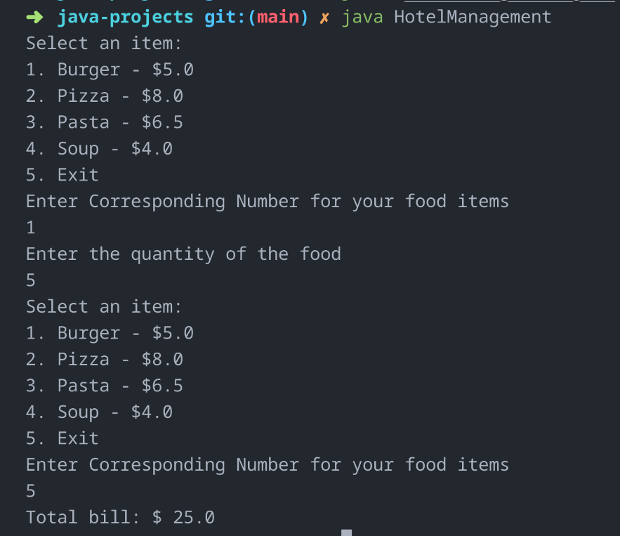
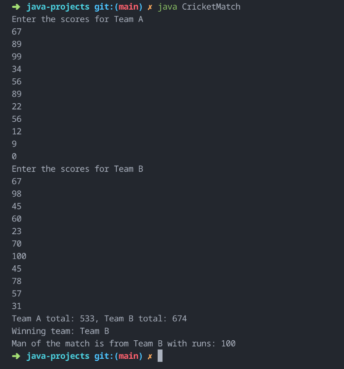
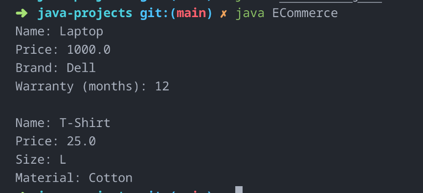

# Java Projects

This repository contains a collection of core Java programs demonstrating OOP concepts, data structures, and basic real-world simulations.

## 📂 Projects

### 🏦 Bank Management System
Basic banking functionalities including account creation, deposits, withdrawals, and balance checking.

**Output:**


---

### 🛒 E-Commerce Platform
Simulates an online store with products, cart system, and order summary.

**Output:**


---

### 🏨 Hotel Management System
Handles hotel room booking, check-in/check-out processes, and billing.

**Output:**


---

### 🏏 Cricket Tournament Tracker
Tracks teams, player stats, and match results in a cricket tournament.

**Output:**


---

### ⚽ Player Management System
Manages player registrations, team formation, and game status updates.

**Output:**


---
### E-Commerce System
Takes different category of products and displays the products.
**Output**
 

## 🚀 Getting Started

1. Clone the repository:
   ```bash
   git clone https://github.com/VINODvoid/java-projects.git
   cd java-projects
